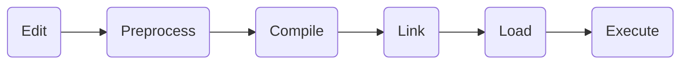

# **CH1 Introduction**
## **C Program 執行階段 (補充)**



* *1. Edit*: 編輯程式碼，即Coding
* *2. Preprocess*: C preprocessor在編譯前會先執行一些特殊指令一些特殊指令，包含包裹其他檔案已進行文本交換。  
  ex: `#include <stdio.h>`
* *3. Compile*: 編譯器將C語言程式碼編譯成機器語言程式碼。
* *4. Link*: 程式碼通常參考在其他地方的function，如standard libaries, etc. `Compiler` 編譯的objet code包含許多“missing part”，linker會連接objet code與missing functions，生成`executable image`。在Linux中compiler+link指令為`gcc`。
* *5. Loading*: `loader`將`executable image`從磁碟轉移到記憶體上。
* *6. Execution*: 最後電腦在CPU控制之下運行程式。

<br>

## **C++ Program 執行階段**


```C++
#include <iostream>  
using namespace std;
int main()
{
    //statement
    return 0;
}
```


- *preprocessor*: 開始於`#include`<標頭檔>（package)，在compiler編譯之前執行一些指令
- *header file*: 標頭檔，記錄一些通用得變數與函數的定義
    - `<iostream>`: 為一標頭檔header file，此為C++標準libary，cout,cin皆為iostream定義的變數
    - `#include "路徑"`：引進自己寫的函式
- *namespace*: 命名空間：裝變數、函數、物件名稱的空間，程式執行時compiler會搜尋所看到的名稱是否定義於程式中或者是std namespace中

<br>

## **編譯與執行**
in terminal:  
cd 檔案所放的目錄  
(1) g++ 檔名.cpp (3-1)./a.out   
or  
(2) g++ 檔名.cpp -o 檔名 （3-2)./檔名


